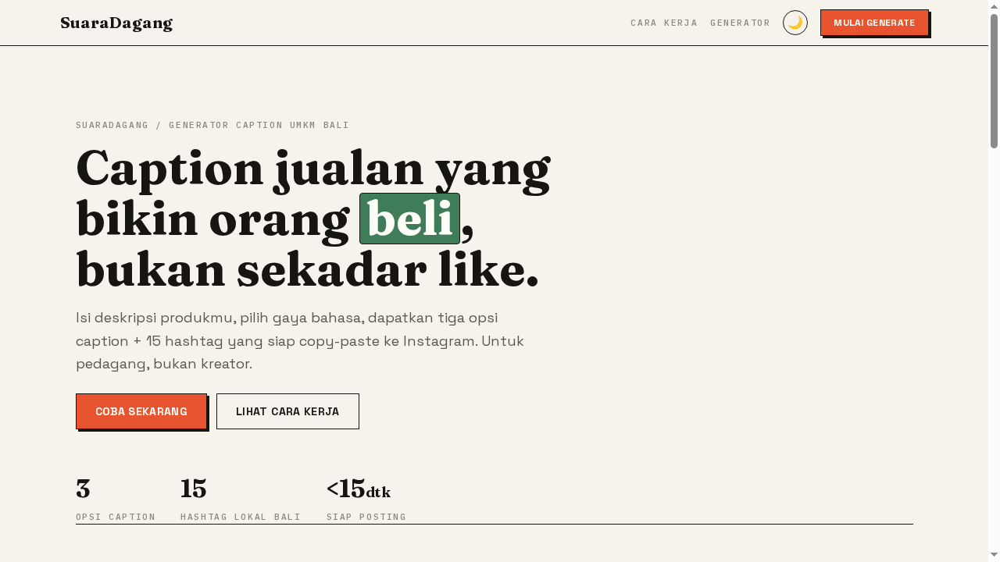
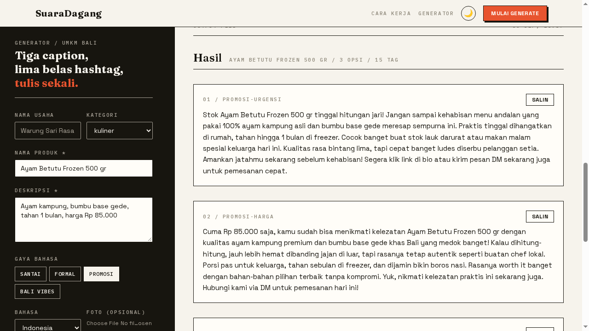

# SuaraDagang

> Caption jualan yang bikin orang *beli*, bukan sekadar like — untuk UMKM Bali.

[](https://suara-dagang.vercel.app)
[](https://nextjs.org)
[](https://aistudio.google.com)
[]()

Isi deskripsi produkmu → pilih **satu** gaya bahasa → dapatkan **3 varian caption**
dalam gaya itu + **15 hashtag siap copy-paste** ke Instagram.



## ✨ Fitur

| | |
|---|---|
| 🎭 **4 gaya bahasa** | Santai · Formal · Promosi · Bali Vibes (Rahajeng, Matur Suksma, Dumogi) |
| 🔀 **3 varian per gaya** | Misal Promosi → urgensi, harga, hype. Pilih 1 gaya, dapat 3 sudut. |
| #️⃣ **15 hashtag** | 5 broad + 5 niche + 5 lokal Bali, banned-filter anti-spam |
| 📸 **Foto opsional** | Vision gagal? Auto-retry tanpa foto — generate tidak pernah blokir |
| 🗂️ **Arsip lokal** | 20 hasil terakhir tersimpan di browser, survive refresh |
| 🌓 **Light + Dark** | Tema tersimpan, ikut preferensi sistem |
| ⚡ **Cache + rate limit** | 10x/jam/IP, cache hit instan tanpa makan kuota |



## 🚀 Coba langsung

**Live:** https://suara-dagang.vercel.app — tanpa daftar, tanpa kartu kredit.

Isi *Nama produk* + *Deskripsi* → pilih gaya → **Generate**.

## 🛠️ Setup lokal

```bash
npm install
cp .env.example .env.local   # isi GEMINI_API_KEY dari Google AI Studio
npm run dev                  # http://localhost:3000
```

Deploy ke Vercel: import repo → tambah env `GEMINI_API_KEY` (+ opsional
`GEMINI_MODEL`) → deploy. Setiap push ke `main` auto-deploy.

## 🧠 Cara kerja

```
Form → POST /api/generate → cache hash? → rate limit → Gemini (3 varian + 15 tag)
     → sanitize hashtag → tampil + simpan ke localStorage
```

- **Model:** `gemini-3.5-flash-lite` (murah, ~$0.30/1M token, cukup untuk caption)
- **Token per request:** ~1300 → 100 generate/hari ≈ **$1.39/bulan**
- **Storage MVP:** localStorage (tanpa database — sengaja, lihat di bawah)

## 🤔 Kenapa localStorage, bukan database?

1. Vercel serverless tidak punya filesystem persisten
2. Tanpa auth, baris database jadi yatim (tak bisa dipisah per user)
3. History + brand profile itu data per-perangkat — pas di localStorage
4. Setup DB memakan jam deadline solo

Database (Neon/Supabase) pindah ke **V2 saat ada auth** — saat itu history
lokal dimigrasi ke tabel per-user.

## ⚠️ Keterbatasan jujur

- Skor hashtag = heuristik (broad/mid/lokal + banned-filter), **bukan**
  pengetahuan algoritma Instagram
- Tone = pola umum caption jualan, bukan riset terukur
- Sisipan Bali = frasa umum, bukan terjemahan penuh tervalidasi
- Rate limit + cache in-memory: reset saat serverless cold start

## ✅ Acceptance criteria MVP

- [x] Produk + deskripsi + kategori → hasil <15 detik
- [x] 3 caption + 15 hashtag tampil, tombol salin bekerja
- [x] History survive refresh
- [x] AI gagal → pesan jelas + retry, app tetap usable

## 🗺️ Roadmap

Auth · database · vision wajib · multi-brand · content calendar · team
workspace · API publik — detail di [`docs/roadmap.md`](docs/roadmap.md).

Desain: [`docs/DESIGN.md`](docs/DESIGN.md) · Arsitektur: [`docs/architecture.md`](docs/architecture.md)

---
Dibangun untuk UMKM Bali · SuaraDagang © 2026
